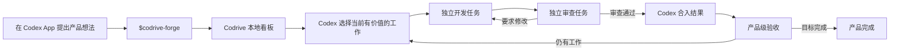

<div align="center">
  <h1>Codrive</h1>
  <p><strong>把一个产品想法，持续变成你可以看见的 Codex 任务。</strong></p>
  <p>在本机自动推进产品规划、开发、独立审查、返工与合入。</p>

  <p>
    <a href="https://www.npmjs.com/package/codrive"></a>
    <a href="https://github.com/lzj960515/codrive/actions/workflows/ci.yml"></a>
    <a href="https://www.npmjs.com/package/codrive"></a>
    <a href="./LICENSE"></a>
  </p>

  <p><a href="./README.md">English</a> · <strong>简体中文</strong></p>
</div>

## Codrive 是什么？

Codrive 是一个轻量的本机服务，用来连接 Codex App 任务、本地任务看板、文件系统产品状态和可复用 Skills。

你只需要在 Codex App 里描述想做的产品。Codex 会把想法整理成产品计划并注册到 Codrive，然后在独立、可见的任务中逐项开发。每一轮审查都会启动全新的独立任务；审查要求修改时，Codrive 让原开发任务继续返工；审查通过后，Codex 自己完成合入，Codrive 再启动下一项真正有价值的工作。

Codrive 不是另一个大模型，也没有重新实现编码智能体。它只是在普通 Codex 主智能体周围提供一个小而可靠的长期产品开发工作流。

> **一个命令，所有状态留在本机，不需要基础设施。** Codrive 不依赖 Docker、PostgreSQL、Redis 或云端服务。

## 为什么使用 Codrive？

- **工作过程可见。** 开发和审查任务会出现在 Codex App 中，而不是藏在后台工作进程里。
- **上下文保持专注。** 每个任务只有一个长期开发任务，每轮审查都使用全新的独立上下文。
- **判断继续交给 Codex。** Codex 决定哪些工作可以并行，并负责理解仓库、开发、测试、审查、解决冲突和合入。
- **流程自动向前推进。** 项目或任务状态变化后，Codrive 立即触发任务选择、审查、返工、合入或产品验收。
- **所有信息留在本机。** 产品文档、任务状态、执行历史和访问凭据都保存在用户电脑上。

## 快速开始

你需要 Node.js 20 或更高版本、Git，以及 `~/.codex` 中可用的 Codex 登录状态。

```bash
npx codrive
```

Codrive 会输出本地看板地址。用浏览器打开后，按照首次运行提示完成初始化：

1. 点击 **Install Skills**，把四个 Codrive Skills 安装到本机智能体技能目录。
2. 回到 Codex App，并进入你想开发的代码仓库。
3. 用类似下面的消息开始：

```text
使用 $codrive-forge 把这个产品想法整理成计划，我确认后注册并启动。
```

选择 **Later** 后，看板左下角会保留一个 Skills 初始化按钮。未来版本内置的 Skills 发生变化时，看板也会再次提示更新。

## 工作方式



Codrive 负责确定性的部分：持久化生命周期状态、执行尝试、Codex 任务 ID、并发限制，以及每个仓库同一时间只允许一个合入任务。Codex 负责需要判断的部分：选择任务、实现、审查、返工、Git 操作、冲突解决、合入和产品验收。

任务选择不是预先固定的依赖图。每次出现空闲并发容量时，一个临时 Codex 任务都会读取最新的产品、任务和仓库事实，判断此刻适合启动哪些待办任务。Codrive 只验证返回的任务 ID 和并发容量，然后为每个选中任务建立独立开发任务。

## Codex 任务关系

| 工作阶段 | Codex 任务行为 |
| --- | --- |
| 开发 | 每个看板任务拥有一个长期 Codex 任务 |
| 返工 | 继续原开发任务 |
| 合入 | 继续原开发任务 |
| 审查 | 每一轮都创建全新的独立任务 |
| 任务选择与产品验收 | 使用临时任务，不占据最近任务列表 |

看板会提供开发和审查任务的直接入口。如果 Codex 需要产品决策，看板会显示问题并引导你回到对应的 Codex 任务；Codrive 不会再造一个聊天界面。

## 内置 Skills

| Skill | 用途 |
| --- | --- |
| `$codrive-forge` | 把产品想法整理为经过确认的产品计划和初始任务 |
| `$codrive-task` | 执行当前开发、审查、返工、合入或验收阶段 |
| `$codrive-work` | 为现有产品增加新需求、里程碑或下一轮工作 |
| `$codrive-control` | 查看进度，并暂停、恢复、重试、取消或记录产品决策 |

Skills 会主动从 Codrive 读取当前项目和任务上下文，因此自动任务消息保持简短，不会反复注入完整产品说明。

## 常用命令

```text
npx codrive          启动 Codrive 和本地看板
npx codrive status   检查本地服务是否正在运行
npx codrive doctor   检查 Node.js、Codex 和登录状态
npx codrive setup    不经过 Web 提示，直接安装 Skills
```

## 安全模型

Codrive 的 HTTP API 只监听 `127.0.0.1`，本地 API 请求使用随机访问令牌保护。自动 Codex 任务使用 `approvalPolicy: "never"` 和完整本机访问权限运行，从而可以连续创建工作树、修改文件、测试、提交、解决冲突、合入并清理现场，无需等待终端审批。

请只注册你信任的仓库和产品指令。Codrive 不开放远程监听地址，也不会把任务数据库发送到 Codrive 云端服务。

## 参与开发

Codrive 使用 Node.js 24 和 pnpm 11.5.1 进行开发，发布包兼容 Node.js 20 及以上版本。

```bash
corepack enable
pnpm install
pnpm typecheck
pnpm test
pnpm build
pnpm dev
```

## 许可证

[MIT](./LICENSE)
